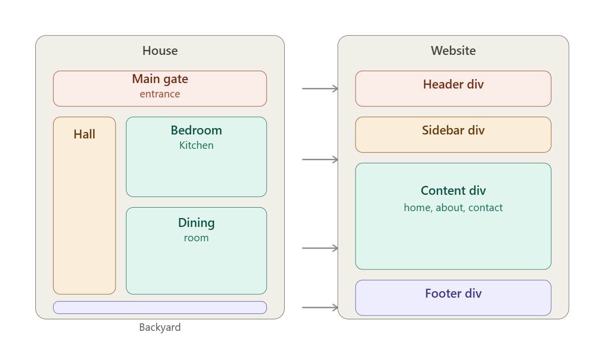
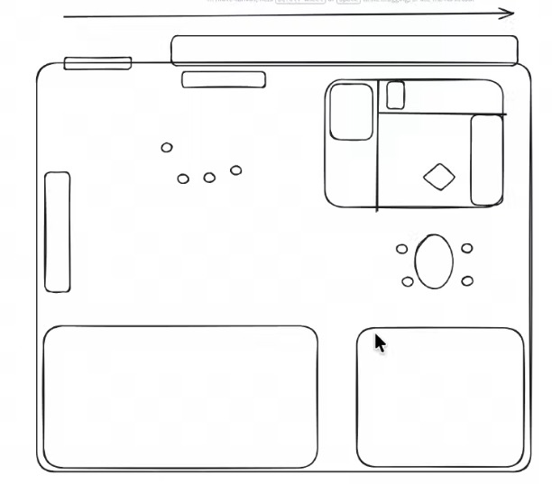
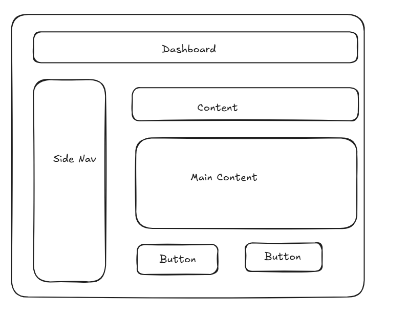

# Day 3 Notes

## What I Learned
Before writing any HTML, plan the page like a house floor plan first.
Each **room** in a house = one **div** in a webpage.

| House | Website |
|---|---|
| Main gate / entrance | Header div |
| Hall (leads to every room) | Sidebar div |
| Bedroom, Kitchen, Dining | Content div (home, about, contact) |
| Backyard | Footer div |

Steps I follow:
1. Sketch boxes only — no styling.
2. Label each box by its purpose.
3. Turn each labeled box into a real `
` with a matching id/class.

This matches the structure I already used:
- `#header` = Main gate
- `#sidenav` = Hall
- content area (`#hero`, `#hero-section`) = Rooms
- `#footer` = Backyard

### Wireframe references

*Fig 1: Rough boxes-only wireframe*

*Fig 2: Labeled wireframe — Dashboard, Side Nav, Content, Main Content, Buttons*

---

## Day 3 Task
Build a multi-page site (Home, Packages, Contact Us + About Us, Services) with the **same Header, Sidebar, Footer** on every page.

- **Header:** Home | Packages | Contact Us links, same on all pages.
- **Sidebar:** Home, About Us, Services, Subscribe with us Form — same on all pages.
- **Home Page:** Banner image + About content + Subscribe with us form.
- **Packages Page:** Table — Tool Name | Purpose | Price | Usage | Subscribe Now.
- **Contact Us Page:** Form posting to `https://platinitee.com/talentlync/form.php` with:
  - User Name — min 3, max 40 characters
  - Email
  - Age — min 18, max 25
  - DOB — future dates not allowed

## What I Implemented
- Header and Sidebar built once and reused identically across `index.html`, `packages.html`, `contact.html`, `aboutus.html`, `services.html`.
- Footer same on every page.
- Home page: banner image done; About content and Subscribe form still missing.
- Packages page: table done with all 5 required columns.
- Contact page: Name (minlength/maxlength) done, Age (min/max) done, Email done.
  - DOB: needs `max` date added so future dates are blocked — not done yet.
  - Form needs `method="post"` added.
