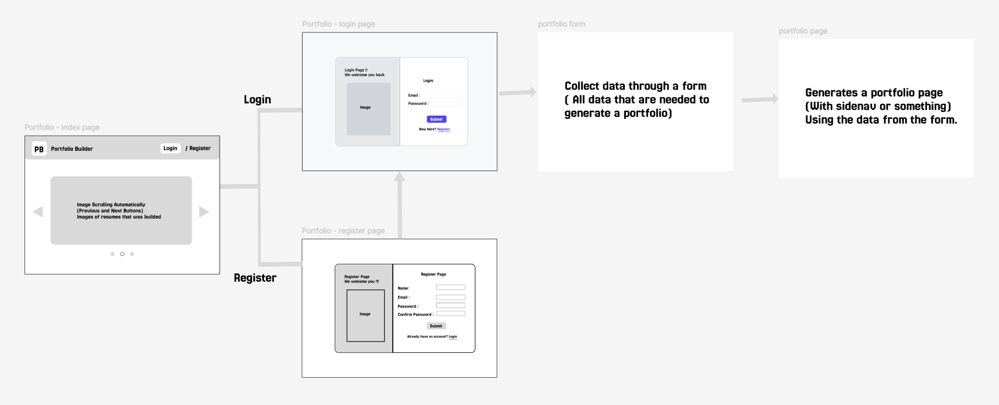
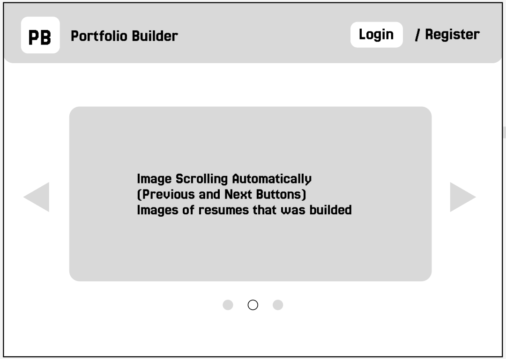
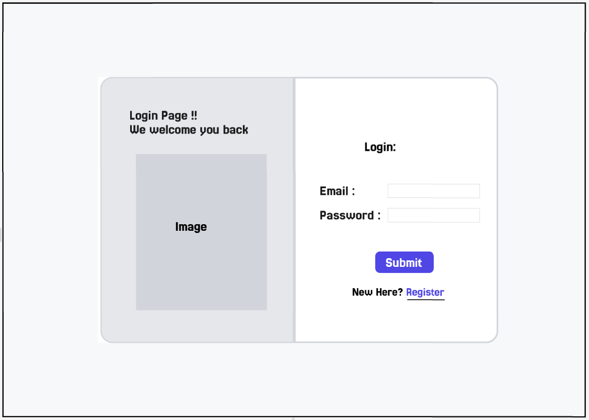
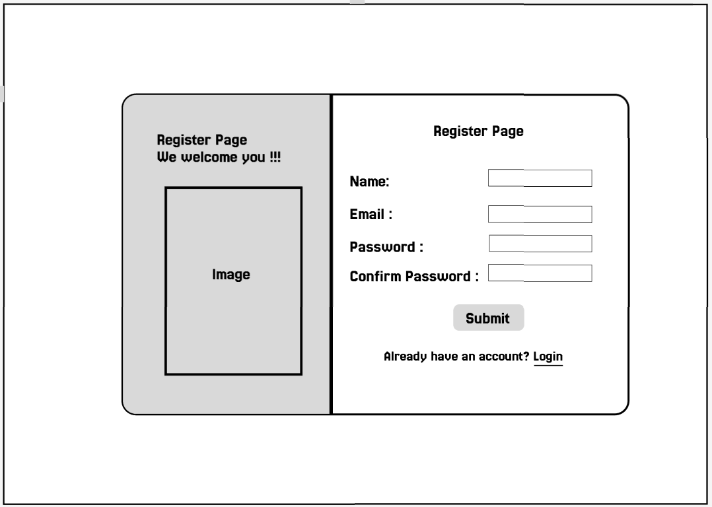
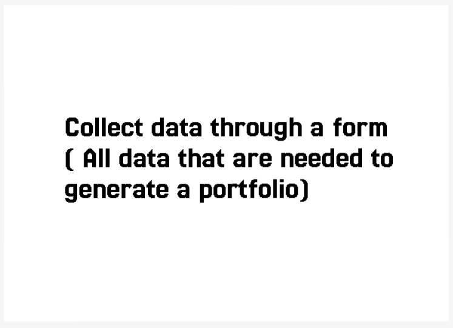
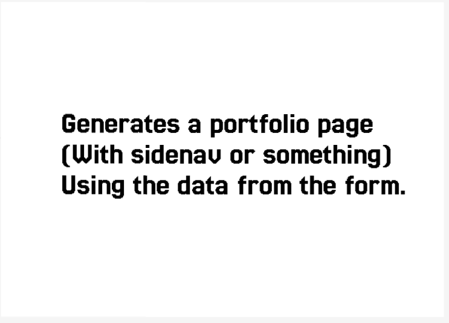
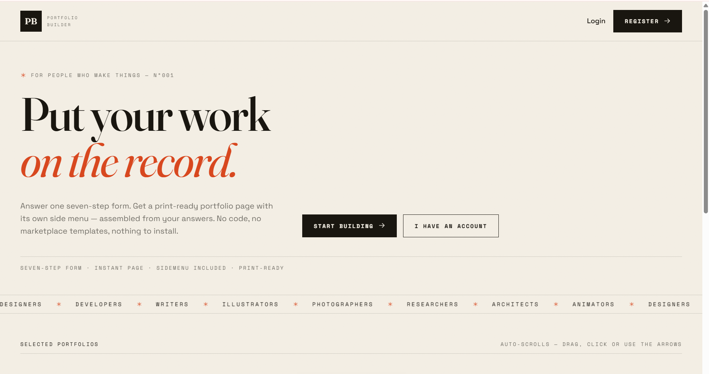

# Portfolio Builder

I need to do a task i.e. building a portfolio website with login, register, form(themes) , portfolio page

Then i analyzed the problem, and I thought to understand the flow of the project. 

So I thought to design some screens. I started designing on figma , here is the link you can visit for whole screens.

[Figma Link](https://www.figma.com/design/cPnofjtBkIzHpT007hHeJS/Untitled?node-id=0-1&t=Srz7df0dVfNd9lIx-0)

## The architecture of my portfolio builder is:

## Home Page:

## Login Page:

## Register Page:

## Portfolio Form Page:

## Portfolio Page:

I started Coding every page , I done with coding.
Then I thought how AI can create the same project.

Then I used [z.ai](https://chat.z.ai/) AI tool to create my project.
Here's the project that was created by [z.ai](https://chat.z.ai/) AI tool.

[Project Link](https://chat.z.ai/space/v131974bv3r0-art)

Landing Page of Portfolio Project created by [z.ai](https://chat.z.ai/)

